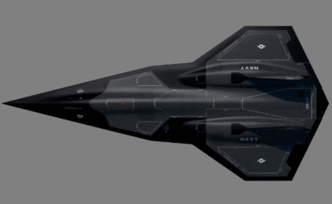
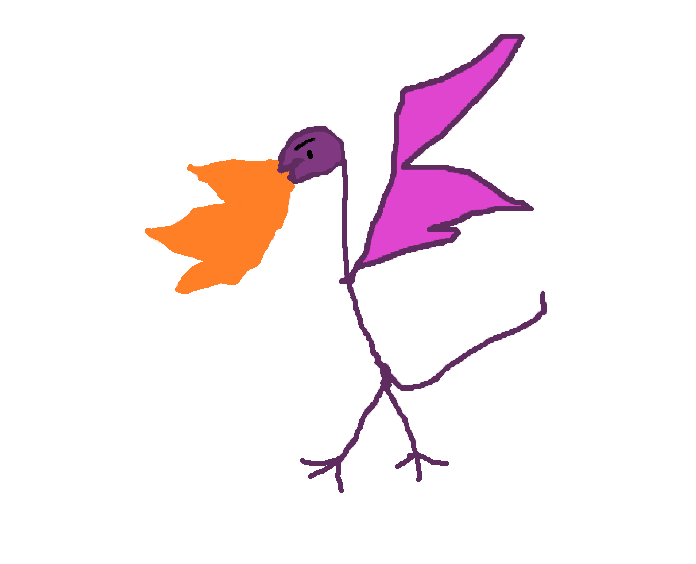
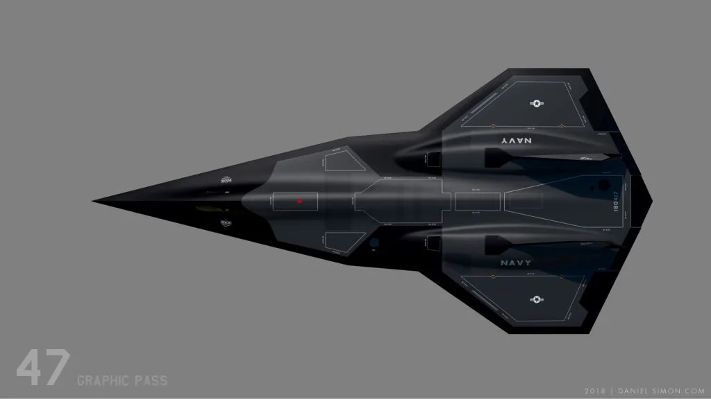
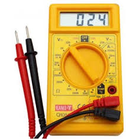

<h1>
DARKSTAR BADGE
</h1>

~A User Guide~

-----

A Lockheed Martin Aeronautics Cyber Range (ACR) project. 
Join us on <a href="https://discord.gg/sgUe73dNS8">discord</a>  

> Disclaimer
>> [!NOTE]
>> Everything about this badge was made using open-source and public information.
>>
>> The protocols were invented specifically for this badge, despite concepts being based on real protocols.
>>
>> This badge is for fun and educational purposes :smile:
-----
<h2>
Overall Badge Purpose
</h2>

<h4>
 ENGAGE in Next Gen Badge Dominace and take-out the opposition using the latest in BLE and IR smart weapons!
</h4>

<h3>

Checkout the Global Scoreboard at <a href="http://airplanes.lol">airplanes.lol</a>

</h3>

-----
## Basics
> Guides are boring, just go use the badge!

##### Updating
- To update badge, simply reset, or from main screen press left and right at same time. 
Youll need to be connected to 'DefCon-Open' wifi.

### Buttons
- There are 4 (four) buttons on the top.  
These act like a d-pad, and the bar under the arrow indicates 'UP' 

- From the main menu, the Up, Down, and Right buttons are used to enter different sub-menus: 
Up button: Settings 
Right button: PHM 
Down button: Lethal Interrogate  

- On most screens: 
Up and Down will scroll through options. 
Right will select or run an action. 
Left is backspace/back.
### LEDS
The RGB LEDs are arranged in 2 sections: 

| LED    | State | Description |
| :----------: | :----------: | :----------: |
| Front | Green | Targetting another badge, can shoot   |
| Front  | Red  | Lethal State, can be shot    |
| Main   | RGB   | Change Passive setting in Settings     |
| Main    | RED Breathe    | Happens while Dead      |

The LEDs next to the power switch have two functions: 
- Blue LED: Indicates that the badge is charging  
- Red LED: Indicates the badge is powered on 
### Display
- 1.47" IPS 320x172 8 pin SPI
### IR RX
> Don't cover these! That's no fun.

- There are 2 (two) IR recievers. They receive IR :smile:
IR is used to shoot nearby badges that you are targetting.
### IR TX
- There is 1 (one) IR LED at the front of the badge which is used to shoot other badges.
### BATTERY
- The badge is powered by a 3.7v lithium 1000 mah 503450 with a 1.25mm JST connector. Charging is done via the USB-C port on the side of the badge. When charging is complete, the blue LED next to the power switch will turn off.
### BUZZER
- Yep its a buzzer, it makes sound.
### LIVERY
<table>
<tr>
<td width="33%">
Lockheed logo 
</td>
<td width="33%">
ACR Team logo 
</td>
<td width="33%">
The unofficial team logo 
</td>
</tr>

<tr>
<td>

</td>

<td>

</td>
<td>

</td>
</tr>

<tr>
<td width="33%">
Skunkworks Skunk 
</td>
<td width="33%">
Defcon32 Theme slogan 
</td>
<td width="33%">
Darkstar Inspired Details 
</td>
</tr>

<td>

</td>
<td>

</td>

<td>

</td>
</tr>
</table>

-----
## ESP32
- The microcontroller of the badge is an ESP32-S3-Wroom-1 containing 16MB of Flash, 8MB of RAM, and a built-in PCB antenna. The microcontroller can communicate with other badges using BLE and talks to the battle space manager over Wi-Fi.

### GPIO Layout

:smirk:

-----
## Advanced stuff

| Feature    | :white_check_mark: / :x: | 
| :---------: | :----------: |
| OTA Updates | :white_check_mark: |
| Encryption    | :white_check_mark: | 

-----
## Beyond Defcon32
- Need to do some configuring, 
Then flash whatever you want :) 
- Write some new functionality, and share it on Socials!  

Keep an eye out for next years badge!

## Suggestions?
This is our first badge.  There will be bugs.  Please be kind and help us make the experience amazing for everyone by reaching out on [discord](https://discord.gg/sgUe73dNS8)
